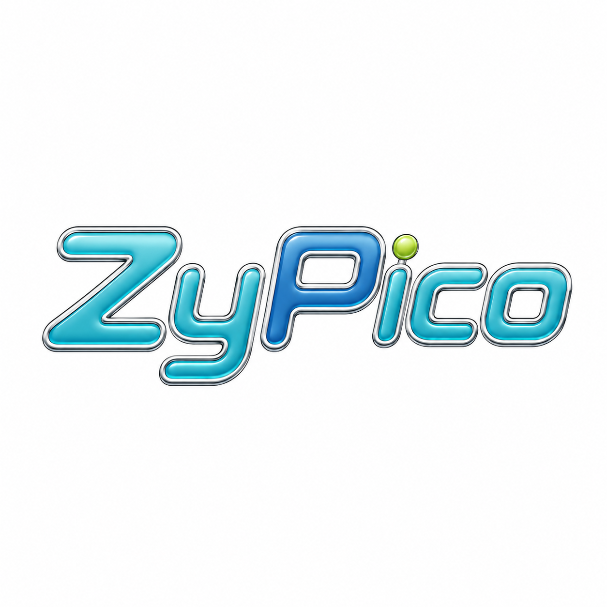

<p align="center">
  
</p>

<h1 align="center">ZyPico — “The Relay”</h1>

<p align="center"><em>A pocket social world that lives inside a radio.</em></p>

---

Picture it: the year is 2002, except it isn't. You're holding a chunky little
handheld with a 128×80 screen, three fat buttons, and a creature on it that's
genuinely happy to see you. It talks to other handhelds **directly**, over the
air, with no cell tower, no Wi-Fi router, no account on somebody's server in
Virginia. You wander into **the Commons**, somebody's already there, you say hi.
Your creature remembers them. Later you teach it a game you wrote yourself.

Now the twist: under that thrift-store-Tamagotchi shell is **Ed25519 identity,
end-to-end encrypted DMs, a multi-hop LoRa mesh, and a sandboxed Lua dev
environment** — a 2002 toy that's secretly a 2026 computer. That tension *is*
ZyPico. It's the whole point.

> **The radio network is the world. The Wisp is your relationship with that
> world. The handheld is both a toy and a genuine little computer.**

---

## How we got here (a short, true story)

ZyPico grew in layers, not in one flash of genius:

1. **Cybiko nostalgia.** The seed: a modern spiritual successor to the **Cybiko** —
   a small, social pocket computer built around *local* wireless, not the
   ordinary internet.
2. **A LoRa pocket computer.** MakerHawk/Heltec hardware; the **LilyGO T-Deck** as
   the dream device (keyboard, screen, ESP32-S3, the right handheld shape).
3. **The Meshtastic detour.** Could Meshtastic be the backbone? Turns out it
   feels like *"IRC meets texting,"* not a general application network — and its
   Android path now wants apps talking to the radio directly anyway. So: **build
   our own platform, our own protocols**, borrow from Meshtastic where useful.
4. **A Lua-capable platform.** A small native layer, most behavior in **Lua** —
   which became a built-in programming environment (the `_>` icon). Pico-8 and
   Picotron set the *vibe*, but this isn't a fantasy console.
5. **Cybiko × Tamagotchi × Digimon.** The handheld shouldn't just *talk* — it
   should *contain a living companion*. Not a clone of existing virtual pets:
   **Wisps**, small signal-born beings tied to communication, exploration,
   forgotten technology, and the network itself.
6. **A world with geography.** **The Relay** (the place), the **Commons** (the
   town board), **Stations** (persistent infrastructure), **Pages**
   (GeoCities-but-make-it-mesh), an Arcade, an exchange, discoverable items.
   Entering the Relay should feel like *going somewhere* — Neopets energy:
   presence, distance, discovery.
7. **Now: a local-first React/Vite app (PWA).** The world, the Wisp systems, the
   interface, and the protocols, prototyped in software so they're real before
   the final embedded hardware is. Served locally — ideally at a friendly
   `zypico.local` — with optional Stations/servers for shared features.

`Cybiko → LoRa pocket computer → Meshtastic experiments → custom Lua platform →
Cybiko + Tamagotchi/Digimon → original Wisps & lore → a GeoCities/Neopets social
world → The Relay as a living local-first network.`

None of those influences sits politely beside the others. They've **fused**.

---

## What it actually does (today)

The whole UI + protocol runs in the **browser**. A **Heltec WiFi LoRa 32 V3**
board is the radio: it serves the web app from its own flash over a Wi-Fi access
point and bridges WebSocket ↔ LoRa. Same code on your desktop (offline) and on
the board (real LoRa) — only the transport differs.

**The handheld — eight places, grouped by meaning:**

| Icon | What's inside |
|---|---|
| 🏠 **Home** | Your **Wisp**: animated **care** (feed/treat/clean/rest/talk — a Flicker nibbles, an Ember swallows whole), three two-button **minigames** (Snackfall, Echo, Bounce), stats + a memory journal. |
| 📡 **The Relay** | The social region as travel-able scenes: **Commons** (public chat), **Travelers** (who's near, DMs, **challenge to battle**), **The Post** (mail), **Pages** (visit/sign guestbooks), **Stations**. |
| 🎮 **Arcade** | Built-in games — **Breakout**, **Tic-Tac-Toe vs CPU** — plus Carts you've collected. |
| 🔧 **Workshop** | An **on-LCD Lua editor**: write a Cart, RUN it live, see real errors (`LINE 4: …`), SAVE, and SHARE it over the mesh. Plus an API cheat-sheet. |
| 🎒 **Bag** | **Items** you earn by playing/battling/exploring — treats, badges, souvenirs — and use (a treat feeds the Wisp). |
| 👤 **Profile** | Identity + encrypted **Vault** backup/restore. |
| ⚙️ **Settings** | Sound, on-screen keyboard, **stay-signed-in**, relay status, and **Switch to Station Mode**. |
| 🔔 **Alerts** | The Tamagotchi attention light — pulses + beeps for new DMs, mail, guestbook notes, or a needy Wisp, and jumps you to the source. |

**The mesh underneath:**

- **Identity** — handle + password → Ed25519 keypair via Argon2id. Fully offline,
  no reset, no account store. Login **persists across reloads** (board session-id
  gated; a reboot or Wi-Fi reconnect re-asks).
- **Encrypted DMs** — X25519 + XChaCha20-Poly1305, sealed end-to-end.
- **The Commons** — an HLC-ordered town square; presence beacons advertise your
  Wisp's form + location; stale Travelers fade out.
- **Mail** — store-and-forward, delivered when a recipient (or a Station) is reachable.
- **Pages & Guestbooks** — peer-served personal pages, signable.
- **Carts** — sandboxed **Lua** (wasmoon) with a small graphics/sound API
  (`cls/pset/line/rect/circ/spr/print/btn/btnp/beep`), **signed** by their author
  and distributed like Pages.
- **Wisp battles** — a two-button, turn-based **commit-and-reveal** duel over LoRa:
  no authority, both devices compute the same score, hash-mismatch = no-result.
- **Multi-hop** — hop-limit repeating with network-wide dedupe + jittered
  rebroadcast, so the world feels larger than radio range. The airtime governor
  is tuned to the board's actual modem (SF9/250k) so chat is responsive, not
  starved.

> **Design is the source of truth:** [`docs/REDESIGN.md`](docs/REDESIGN.md) (the
> current experience direction), [`docs/DESIGN.md`](docs/DESIGN.md),
> [`docs/protocol.md`](docs/protocol.md), and [`docs/adr/`](docs/adr).

---

## Quick start

**Prereqs:** Node 22+ & npm. PlatformIO (`pio`) only to flash a board. Python 3 +
Pillow only to regenerate logo art.

### Run it in a browser (no hardware)
```bash
npm install
npm run dev          # http://localhost:5173
```
Offline-first: with no board it shows `OFFLINE`, but the Wisp, care, minigames,
Workshop, and login all work. Make a handle + password to enter.

### Quality gates
```bash
npm run typecheck    # tsc, strict
npm test             # vitest — 145 deterministic unit tests
npm run build        # production bundle → dist/
```

### Flash a Heltec WiFi LoRa 32 V3
```bash
npm run build
rm -rf firmware/heltec-v3/data && cp -r dist firmware/heltec-v3/data
pio run -d firmware/heltec-v3 -t upload      # firmware (C++)
pio run -d firmware/heltec-v3 -t uploadfs    # web bundle (LittleFS)
# multiple boards: add --upload-port /dev/ttyUSB0  (etc.)
```
Firmware changes need `-t upload`; web-only changes need just `-t uploadfs`.
**Region:** default **US 915 MHz**; set `-D ZYPICO_LORA_FREQ=868.0` in
`firmware/heltec-v3/platformio.ini` for EU. All boards must match.

### Use it on hardware
1. Power on → ZyPico logo (USER button shows AP / node / devices-in-range).
2. Join the open Wi-Fi AP **`ZyPico-XXXXXXXX`** (one device per board).
3. The page auto-opens (captive portal) — or visit **`zypico.local`** / `192.168.4.1`.
4. Log in. With a second board nearby you'll discover each other in **Travelers**
   and chat in the **Commons** over real LoRa.

---

## Station mode (turn a board into infrastructure)

A board can be toggled from a Wisp handheld into a dedicated **Station** — no
Wisp, no games, just infrastructure. **Settings → STATION MODE** reboots it into
station mode, where it:

1. broadcasts a **`ZyPico-Setup-XXXX`** Wi-Fi AP with a captive **setup page**
   (scan networks → enter your password),
2. **joins your home Wi-Fi** and is reachable at its LAN IP with a small
   **management page** (name, advertised services, status),
3. **beacons as a STATION** (Ed25519-signed) so Travelers see it in the Relay, and
4. **repeats LoRa frames** to extend the mesh's range.

(Hold the **USER button ~3s at boot** to force a Station back to handheld mode.)

There's also the original **"full Station" daemon** — a persistent Node process
wired to a board over USB, for store-and-forward Mail, Page hosting, deeper
Commons memory, and encrypted Vault backups:
```bash
sg dialout -c "ZYPICO_STATION_NAME=HarborLight ZYPICO_STATION_PW=secret \
  ZYPICO_STATION_PORT=/dev/ttyUSB0 npx vite-node tools/station/station.ts"
```

---

## Testing over real LoRa (two boards)

No mesh simulator anywhere — tests run on **actual radios**. A serial harness
drives **both** boards over USB at once and runs the real `RelayClient` against
the physical SX1262s.
```bash
# Linux: serial ports are root:dialout, so run under `sg dialout`.
sg dialout -c "npx vite-node tools/harness/roundtrip.ts"     # presence/DM/commons/dedupe
sg dialout -c "npx vite-node tools/harness/comms-deep.ts"    # bidirectional, through the governor
sg dialout -c "npx vite-node tools/harness/station-device.ts"# device-Station beacon + repeater
```
Boards must run current firmware; ports default to `/dev/ttyUSB0` + `/dev/ttyUSB1`
(`PORT_A`/`PORT_B` to override). More per-subsystem scripts live in
[`tools/harness/`](tools/harness): `pages`, `mail`, `store-forward`, `vault`,
`cart`, `commons-history`, …

---

## Repo layout

```
src/core/            framework-agnostic: protocol, identity/crypto, companion (Wisp), items
src/app/             RelayClient (mesh spine) + per-identity local storage
src/ui/              React shell, domain hooks, the 128×80 pixel screen + scenes,
                       Lua cart runtime, Wisp minigames, Workshop editor
firmware/heltec-v3/   ESP32-S3 firmware — client (WiFi AP + WS↔LoRa) + station module
tools/harness/        two-board real-radio test harness
tools/station/        the persistent "full Station" Node daemon
docs/                 REDESIGN.md + DESIGN.md (canonical), protocol.md, adr/
```

## Tech

React + TypeScript (strict) + Vite + Vitest · `@noble/*` crypto (Ed25519,
X25519, XChaCha20, Argon2id) · wasmoon (sandboxed Lua) · RadioLib + ESP-Arduino
on an ESP32-S3 + SX1262 · `rweather/Crypto` (firmware-side Ed25519). No server
required; no telemetry; no internet — that's a feature.

---

<p align="center"><sub>An <strong>unofficial continuation in spirit</strong> of the
Cybiko — not a Cybiko product, not literally a fantasy console. Just a little
radio world we wanted to exist.</sub></p>
